# pi-comic-scanner
Author: Zane Miller
Email: millerzanem@gmail.com

Raspberry Pi comic book barcode scanner and lookup. This project uses a Raspberry Pi 3 with a 32 GB microSD card running Raspberry Pi OS (64-bit) and an attached RPI Barcode Reader HAT. 

# Purpose:
With an accumulating comic book collection, I currently pay ~$3/month for an
app (CLZ Comics) to manage my catalog of comics. I have a handful of hard to
find Raspberry Pi's sitting around the house and wanted to put some of them to
use while I look for a new job. I recently put one of them to use as an
integrated Smart Home Controller Touchscreen Kiosk. With the Barcode
Scanner/Raspberry Pi, the goal is to develop accompanying software that can (1)
read in barcodes from comic books;  (2) use the barcoded isbn to look up the
comic book and prefill a database entity form for review;  (3) and then commit
the entries to local database server hosted on my linux server. From there I
will be able to develop an interactive UI that I can integrate with my smart
home controller and touch screen.

# Table of Contents
<!-- TOC -->
* [1. **What You Need**](#1-what-you-need)
* [2. **Resources**](#2-resources)
* [3. **Notes**](#3-notes)
* [4. **Scanner Set-Up Instructions**](#4-set-up-instructions)
   * [A. **Set Up Raspberry Pi**](#a-set-up-raspberry-pi)
   * [B. **Connect Barcode HAT to Raspberry
     Pi**](#b-connect-barcode-hat-to-raspberry-pi)
   * [C. **Start up the Raspberry Pi**](#c-start-up-the-raspberry-pi)
   * [D. **Configuring Raspberry Pi to work with
     scanner**](#d-configuring-raspberry-pi-to-work-with-scanner)
   * [E. **Configure the Scanner**](#e-configure-the-scanner)
   * [F. **Configure the Raspberry Pi Serial
     Interface**](#f-configure-the-raspberry-pi-serial-interface)
   * [G. **Test scanner with a sample
     program**](#g-test-scanner-with-a-sample-program)
   * [H. **Connecting Barcode Reader HAT to a
     Mac**](#h-connecting-barcode-reader-hat-to-a-mac)
   * [I. **Enabling scanner to read 5 digit add on
     codes**](#i-enabling-scanner-to-read-5-digit-add-on-codes)
* [5. Known Issues](#5-known-issues)
* [6. Configurations](#6-configurations)
<!-- TOC -->

# 1. **What You Need**

1. Raspberry Pi 3 (If you can find one! I happened to have a few lying around.)
2. [Raspberry Pi Imager](https://www.raspberrypi.com/software/)
   * Raspberry Pi Imager is an app available from Raspberry Pi on MacOS, Linux, and Windows () that allows you to quickly install Raspberry Pi OS and other operating systems to a microSD card.
3. A 16+ GB microSD card
4. [Raspberry Pi 12.5W Micro USB Power Supply](https://www.raspberrypi.com/products/micro-usb-power-supply/)
5. [RPI Barcode Reader HAT from sb Components](https://shop.sb-components.co.uk/products/barcode-hat-for-raspberry-pi) or any DE2120 Barcode Scanner like this [SparkFun 2D Barcode Scanner Breakout](https://www.sparkfun.com/products/18088)
6. [Python DE2120_Py package](https://pypi.org/project/de2120-barcode-scanner/)

# 2. **Resources**

1. [2D Barcode Scanner Settings Manual](https://cdn.sparkfun.com/assets/b/5/0/e/e/DY_Scan_Setting_Manual-DE2120___19.4.6___.pdf)
2. [DE2120 Barcode Scanner Python Package](https://pypi.org/project/de2120-barcode-scanner/)
3. [DE2120 Barcode Scanner API Reference](https://de2120-py.readthedocs.io/en/latest/apiref.html)
4. [Raspberry Pi OS](https://www.raspberrypi.com/software/)
5. [sparkfun/DE2120_Py GitHub Repository](https://github.com/sparkfun/DE2120_Py)

# 3. **Notes**

- I'm using the [Barcode HAT for Raspberry Pi](https://shop.sb-components.co.uk/products/barcode-hat-for-raspberry-pi) from SB Components but found their documentation lacking which is why you'll see links referenced to SparkFun's documentation on a similar DE2120 Barcode Scanner.

# 4. **Scanner Set-Up Instructions**

## A. **Set Up Raspberry Pi**
   1. **Open Raspberry Pi Imager** 
   
   2. **Select Operating System**
      - "Choose OS" -> "Raspberry Pi OS (Other)" -> Raspberry Pi OS (64-bit) 
   
   3. **Select Storage** 
      * In my case, I'm using an SD Card Reader plugged into a USB-C port on my laptop. Make sure you choose the correct volume and nothing is stored on the microSD card as the imager will completely wipe the microSD card before writing the OS image.
   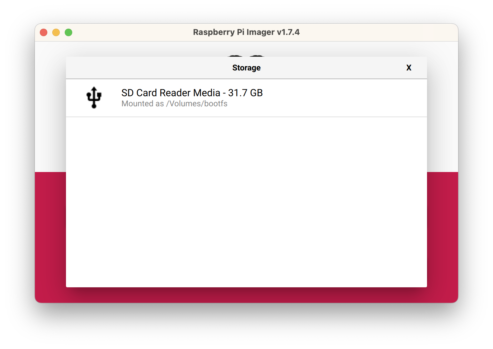
   4. **Configure the Raspberry Pi before writing:**
      1. **set the hostname**:
         * I give mine a unique hostname so I can tell my numerous Raspberry Pi projects apart. 
      
      2. **Enable SSH (Optional):**
         * Enabling SSH allows you to connect to the Raspberry Pi without a monitor through the command line on another computer.
      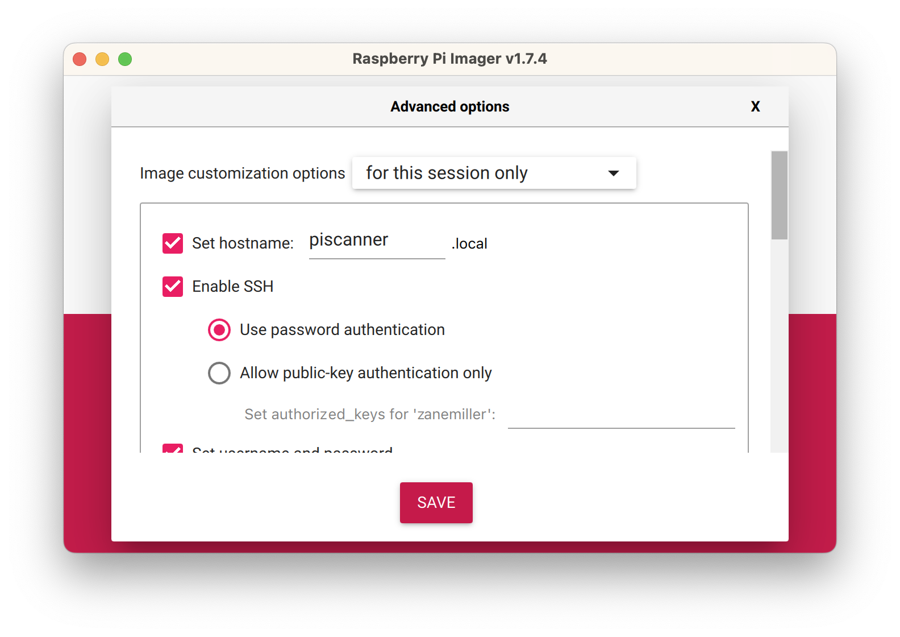
      3. **Set a username and password for the Raspberry Pi:**
         1. The default username and password on a Raspberry Pi is not secure so I configure my own here. 
      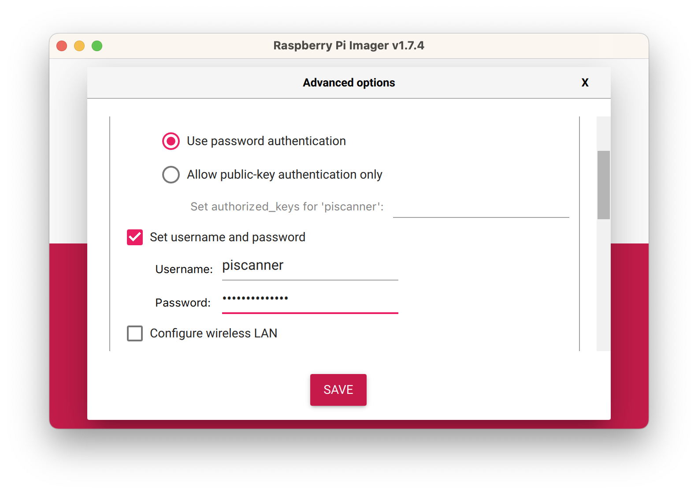
      4. **Configure wireless LAN**
         * This allows the Raspberry Pi to boot with the preconfigured network name and password for headless operation.
      
   5. **Write the image to the microSD Card**
      * Reminder: the imager will erase all existing data on the microSD card so make sure you've selected the correct write destination.
   
   6. **After completion you should see a success response.**
      * Its now safe to eject the microSD card
   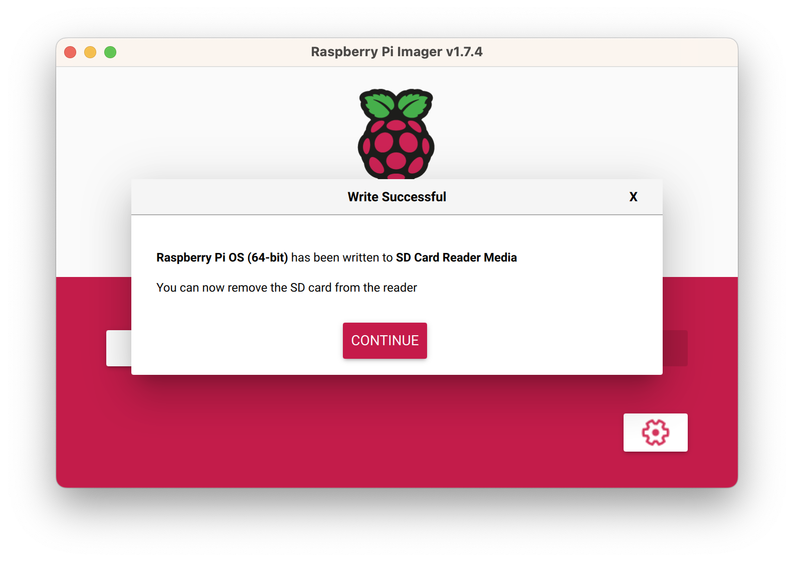

## B. **Connect Barcode HAT to Raspberry Pi**

   * The HAT connects directly to the 40 GPIO pins on the Raspberry Pi
      * Im using some M2.5 x 16mm standoffs to support the HAT  

## C. **Start up the Raspberry Pi**
   1. **Insert the SD card into the microSD card slot on the Raspberry Pi and plug it in.**
      * You should hear the scanner module beep during the power on cycle.
      * After the Pi has had a moment or two to power up, we're going to head over to the command terminal on our local computer and finish setting up the Raspberry Pi.

## D. **Configuring Raspberry Pi to work with scanner**
1. **From your local command line, SSH into the Raspberry Pi**
   - Your username and hostname might be different. In my case piscanner is both the hostname and username.
   - If this is the first time connecting the Pi via the command line you may be prompted to add the Pi to the list of known hosts. Type yes.
   ```shell
   ssh username@hostname.local
   ```
   
2. **Update the Raspberry Pi package list**
   ```shell
   sudo apt update
   ```
   
3. **Upgrade all the installed packages to their latest versions.** 
   * "full-upgrade" is preferred over the simple "upgrade", as it also picks up any dependency changes that may have been made.
   * If prompted to continue, type Y
   * This will take a minute!
   ```shell
   sudo apt full-upgrade
   ```
   
4. **Install DE2120 Barcode Scanner Python module** 
   * https://de2120-py.readthedocs.io/en/latest/apiref.html#de2120-barcode-scanner
   ```shell
   sudo pip install de2120-barcode-scanner
   ```
   
5. **Update the DE2120 Barcode Scanner module to read from ttyS0 serial interface**
   ```shell
   sudo nano /usr/local/lib/python3.9/dist-packages/de2120_barcode_scanner.py
   ```
   1. On line 178 replace "/dev/ttyACM0, 115200" with "/dev/ttyS0, 9600" 
   
   
   2. Write and Exit
6. **Restart the Raspberry Pi**
   ```shell
   sudo reboot
   ```

## E. **Configure the Scanner**
1. **Restore the scanner's factory default settings if this is the first time setting it up.** 
   * Reading the "Restore default settings" barcode will restore all barcode reader property settings to the factory state.  
   * You can find additional documentation on the DE2120 Scanner and its functionality here:
   * https://cdn.sparkfun.com/assets/b/5/0/e/e/DY_Scan_Setting_Manual-DE2120___19.4.6___.pdf
   
2. **We're going to use the Barcode HAT with the TTL/RS232 serial communication
   interface.**
   
3. **And set the baud rate to 9600**  
   

## F. **Configure the Raspberry Pi Serial Interface**
1. **Configure Serial Peripheral Interface (SPI)**
   1. **Open the Raspberry Pi configuration UI**
       ```bash
       sudo raspi-config
       ```
   2. **Select "Interface Options"**
   
   3. **Select "SPI"**
   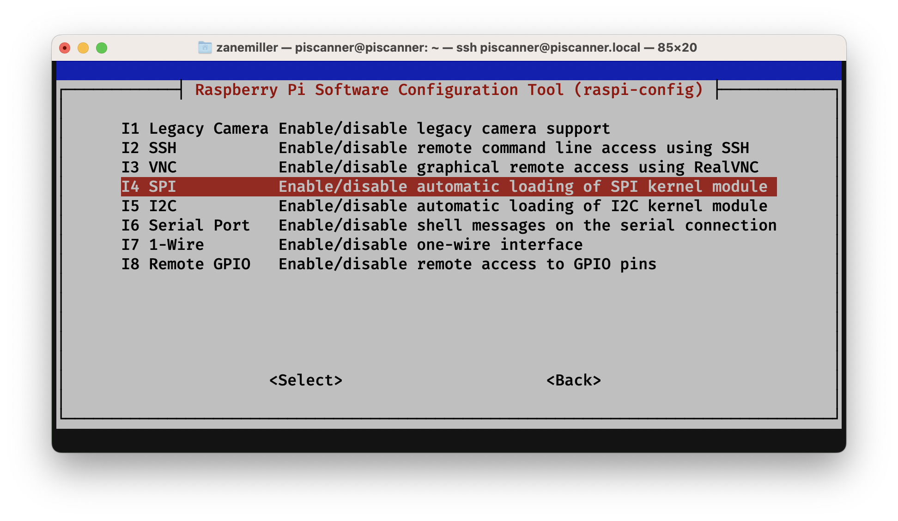
   4. **"Would you like the SPI interface to be enabled?" YES**
   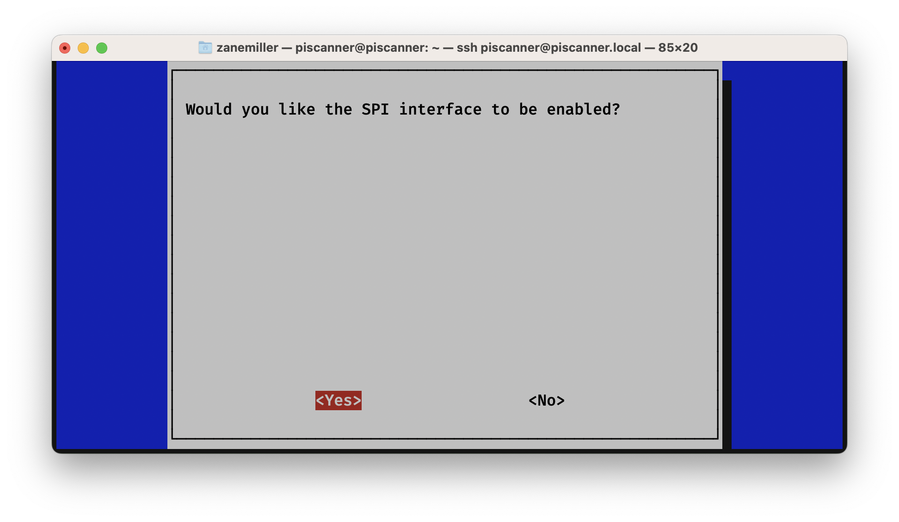
   5. **"The SPI interface is enabled." OK**
   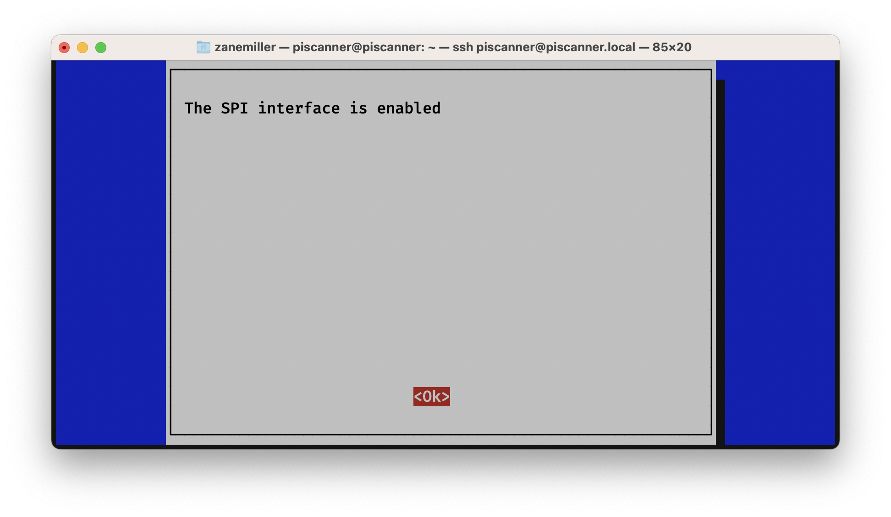
2. **Enable Serial Connection**
   1. **Select "Interface Options"**
   
   2. **Select "Serial Port"**
   
   3. **"Would you like a login shell to be accessible over serial?" NO**
   
   4. **"Would you like the serial port hardware to be enabled?" YES**
   
   5. **Confirm OK**
   
3. **Finish and Reboot**
   1. **Select Finish** 
   
   2. **Reboot YES**
   

## G. **Test scanner with a sample program**
1.  **Download the example [qde2120_ex1_serial_scan.py](https://github.com/zanemmiller2/pi-comic-scanner/blob/59ec5604171b4c444cbe6549371fa168d4c4c61d/examples/qde2120_ex1_serial_scan.py) program.** 
2. **Run the example program from the command line:**
   ```shell
   python qde2120_ex1_serial_scan.py
   ```
   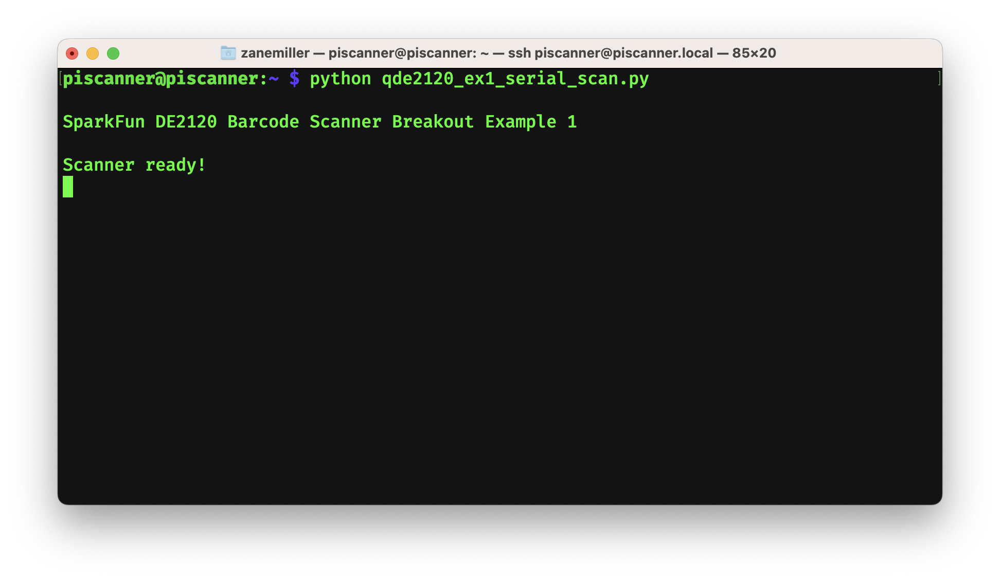
3. **Test it out by scanning some barcodes**
   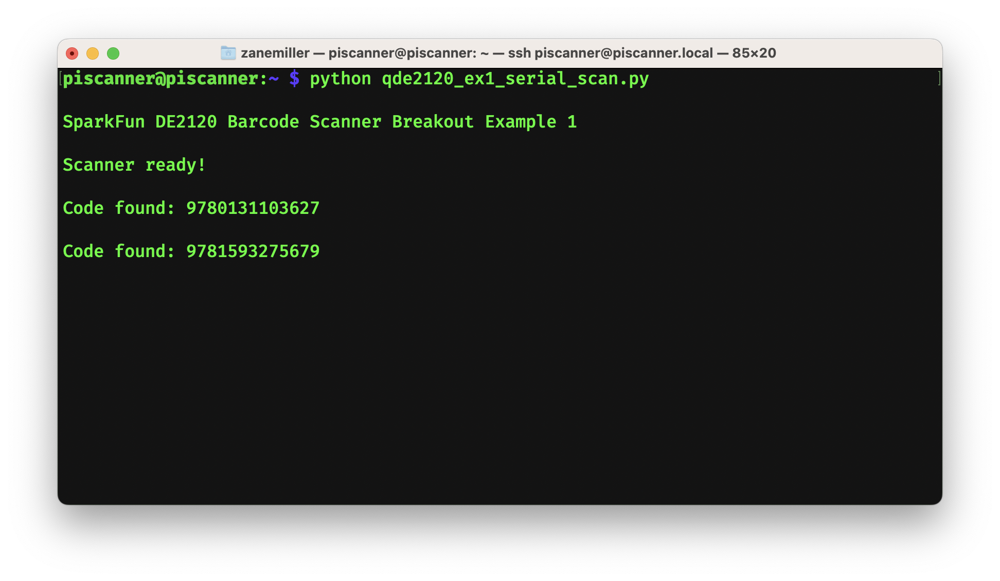

## H. **Connecting Barcode Reader HAT to a Mac**
* I'm setting it up this way, or at least giving myself the option, so I can develop the software on either the laptop or the Raspberry Pi.
1. **Connect the Barcode Reader HAT's mini USB port to your computers USB port**
2. **Set the barcode reader to USB virtual serial communication mode**
   
3. **Update the DE2120 Barcode Scanner module to read from the appropriate USB serial port**
   ```shell
   sudo nano /usr/local/lib/python3.9/dist-packages/de2120_barcode_scanner.py
   ```
   1. On line 178 replace "/dev/ttyACM0, 115200" with "/dev/[YOUR_USB_SERIAL_PORT], 9600" 
      * In my case the usb serial port is cu.usbmodem141101
   
   
   2. Write and Exit
4. **I found the USB Serial Port using [Cool Term](http://freeware.the-meiers.org)**
   * CoolTerm is a simple serial port terminal application (no terminal emulation) that is geared towards hobbyists and professionals with a need to exchange data with hardware connected to serial ports such as servo controllers, robotic kits, GPS receivers, microcontrollers, etc.
   1. With the Barcode Reader connected and turned on, open Cool Term
   2. Open "Options"
   3. Select "Serial Port Options"
   4. In the "Port" drop down menu you should see a list of available ports. In my case, usbmodem141101 is the name of the connected Barcode Reader.
   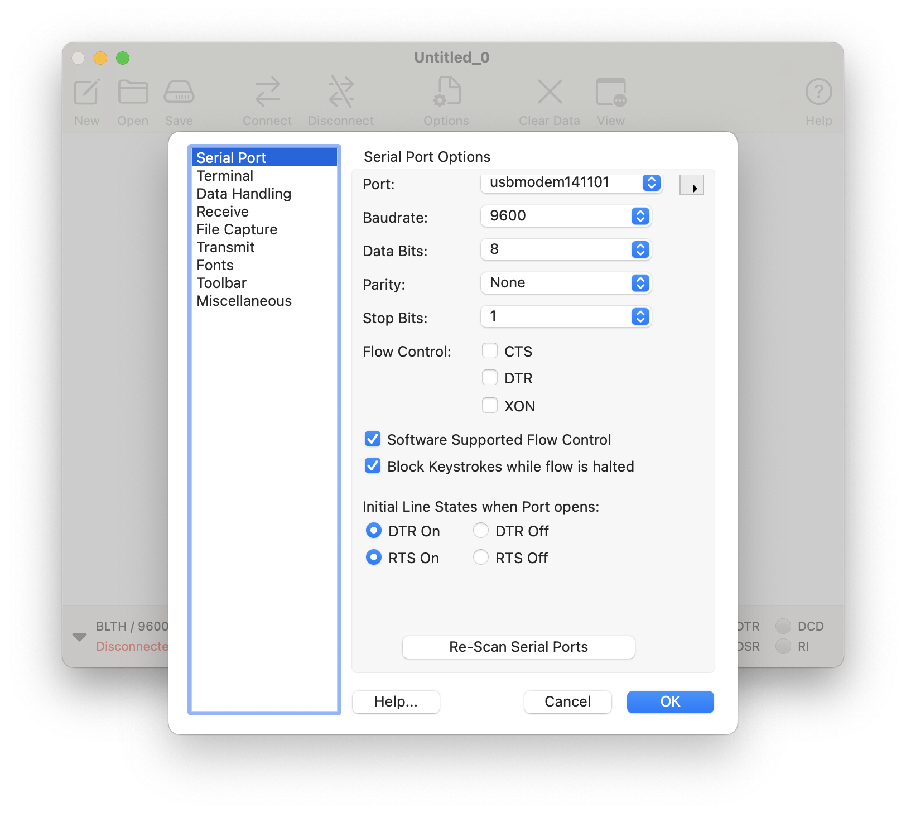
   5. This will be the serial port you use in step 3 above.
5. [**Test scanner with a sample program**](#g-test-scanner-with-a-sample-program)
   * You might have to unplug the scanner and plug it back in. 

## I. **Enabling scanner to read 5 digit add on codes**
* NOTE: For reasons I'm unclear on at this time, in order to get the barcode reader to pickup the 5 digit add on code present with Marvel Comics, I had to enable to following settings:
1. **Enable 1D and 2D Symbologies**
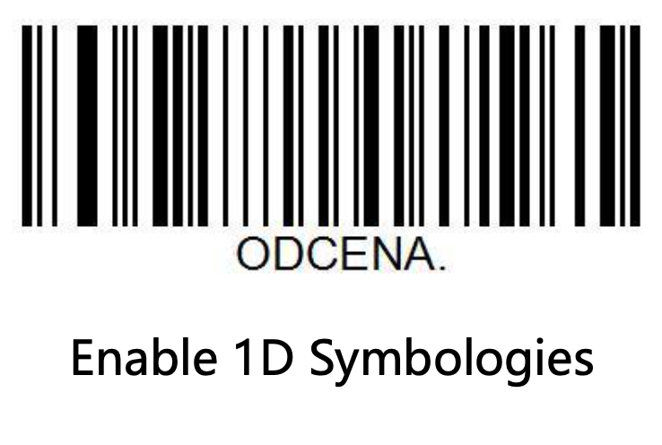
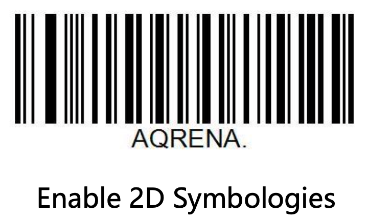
2. **Enable 2-Digit and 5-Digit Add-On Codes**
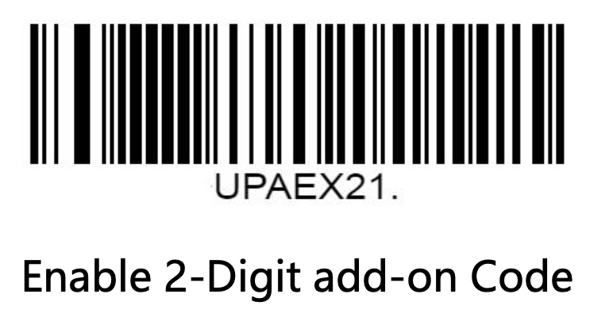
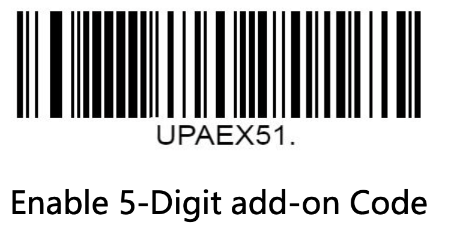
3. **Enable Add-on Code Required**
   

# 5. **Known Issues**

1. I've been experiencing what appears to be a race condition with the
   de2120_barcode_scanner.py's send_command() function which appears to be
   tracing back to the serial.serialposix.py read() function. The "if not read:
   break" within the try statement is where I've narrowed it down to...see
   below:
   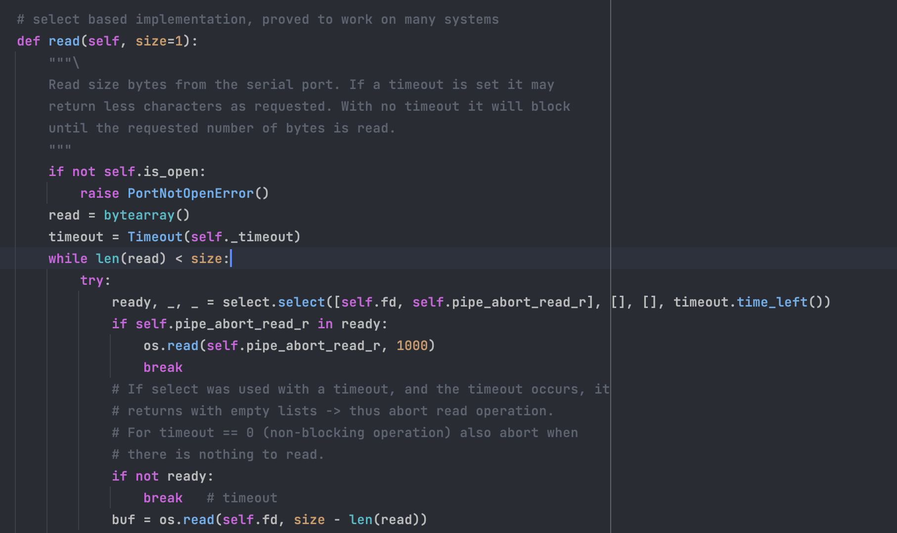
    * For now I bypass this by always returning True from
      de2120_barcode_scanner.is_connected() and
      de2120_barcode_scanner.send_command() functions:
      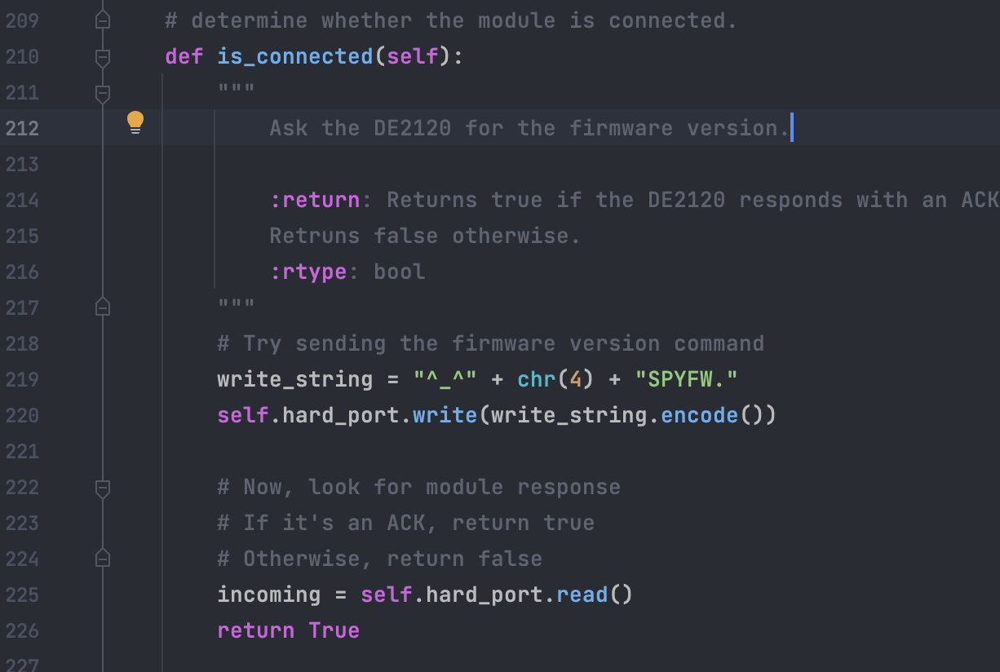
      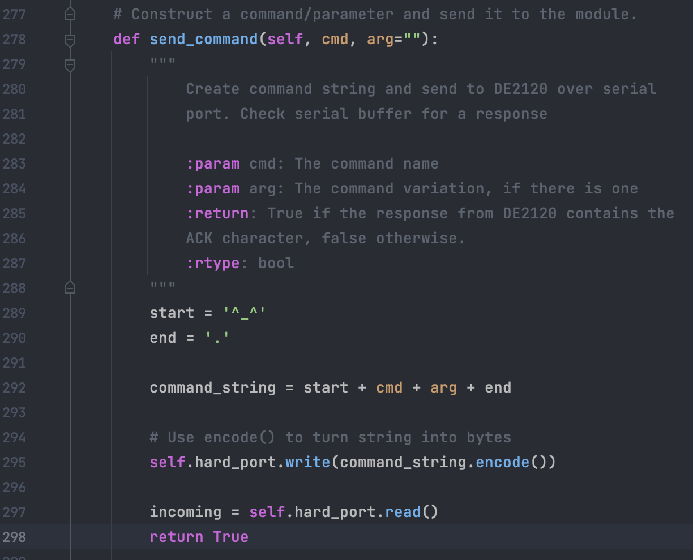

# 6. **Configurations**

1. Database:
   1. Automated backup dump to cronjob at 4am every Saturday morning
      ```bash
      0 4 * * 6 /usr/bin/mysqldump --routines -u [DB_USERNAME] -p '[DB_PASSWORD]' [DB_NAME] > ${HOME}/[PATH]/[FILE_NAME.sql]
      ```
   2. Database Relational Model
      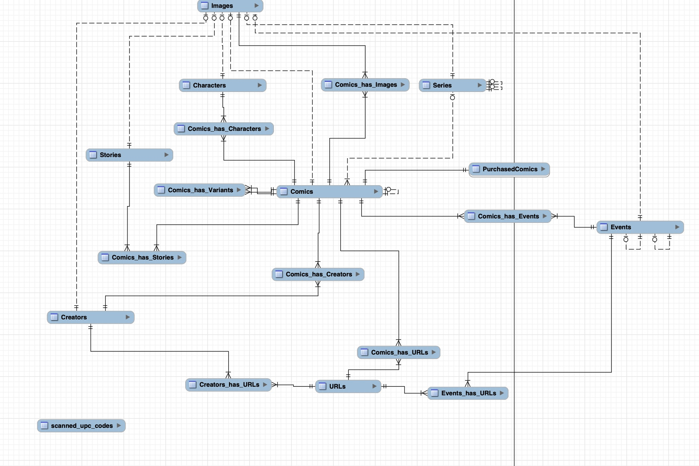
2. Directory Structure
   1. code/
      1. classes/
         - lookup_driver.py
         - scanner_driver.py
      2. data_objects/
         - comic_book_object.py
      3. database/
         - db_driver.py
      4. ui_drivers/
         - lookup_ui_driver.py
         - scanner_ui_driver.py
   2. Resources
      - comic_bookdb.mwb
      - DY_Scan_Setting_Manual-DE2120.pdf


   


   
      
      
   

